# C4 Level 1 — System Context Diagram

> **C4 Level:** 1 — System Context  
> **Version:** 1.1  
> **Date:** 2026-02-23  
> **Related:** [README](00_README.md) | [Container Diagram →](02_CONTAINER_DIAGRAM.md)

---

## Purpose

The System Context diagram shows the **YAM Agri Platform** as a single box, surrounded by:
- The **people** (users) who interact with it
- The **external software systems** it depends on or integrates with

This is the highest-level view — it answers: **What does the system do and who uses it?**

---

## Diagram

```mermaid
C4Context
    title System Context — YAM Agri Platform V1.1

    %% ─── People (Users) ───────────────────────────────────────────────────────
    Person(farmer,       "U1 · Smallholder Farmer",    "Registers harvest lots and receives\nalerts via SMS. Feature phone only.")
    Person(supervisor,   "U2 · Farm Supervisor",       "Creates lots, captures GPS, schedules\ncrew. Android tablet + offline PWA.")
    Person(inspector,    "U3 · QA / Food Safety Insp.","Records QC tests, certificates, HACCP\nchecklists. Approves high-risk actions.")
    Person(operator,     "U4 · Silo / Store Operator", "Monitors bins, imports scale tickets,\ntriages sensor alerts. Frappe Desk.")
    Person(logistics,    "U5 · Logistics Coordinator", "Manages shipment lots, dispatches\ntrucks. Mobile PWA + maps.")
    Person(owner,        "U6 · Agri-Business Owner",   "Views dashboards, compliance reports,\nAI insights. Final approver.")
    Person(itadmin,      "U7 · System Admin / IT",     "Manages infra, Docker, CI, backups,\nuser accounts.")
    Person(auditor,      "U8 · External Auditor/Donor","Reviews evidence packs and compliance\nreports. Read-only portal.")
    Person(aiagent,      "U9 · AI Copilot (non-human)","Suggests compliance checks, CAPA\ndrafts, evidence narratives.")

    %% ─── The System ────────────────────────────────────────────────────────────
    System(yam, "YAM Agri Platform", "Cereal-crop supply chain quality\nand traceability system.\nFrappe + ERPNext + yam_agri_core.\nHosted on Docker Compose (dev)\nor k3s (staging/production).")

    %% ─── External Systems ──────────────────────────────────────────────────────
    System_Ext(sms,      "SMS Gateway\n(Africa's Talking)", "Delivers structured Arabic SMS\ncommands to/from U1 farmers.")
    System_Ext(llm,      "Cloud LLM API\n(OpenAI / Anthropic)", "Provides AI completions for\ncompliance checks, CAPA drafts,\nevidence narratives.\n(Redacted via AI Gateway.)")
    System_Ext(weather,  "Weather API\n(Open-Meteo)", "Free weather data: rainfall,\nhumidity, temperature forecasts\nfor agricultural decisions.")
    System_Ext(satellite,"Satellite / NDVI\n(Sentinel Hub / ESA)", "Satellite imagery and derived\ncrop-stress indices (NDVI,\nflood risk) for field analysis.")
    System_Ext(fao,      "FAO / Standards\nDatabases", "FAO GAP checklists, Codex\nAlimentarius MRLs, GIEWS\ncommodity prices.")
    System_Ext(iot,      "IoT Sensors & Scales\n(Field Hardware)", "Temperature, humidity, CO₂,\nmoisture sensors and\nweigh-bridges at silos/farms.")

    %% ─── Relationships ─────────────────────────────────────────────────────────
    Rel(farmer,     yam, "Sends lot + weight commands,\nreceives alerts", "SMS / Africa's Talking")
    Rel(supervisor, yam, "Creates lots, records GPS,\nschedules crew", "Mobile PWA (HTTPS + offline sync)")
    Rel(inspector,  yam, "Records QC tests, certificates,\napproves high-risk actions", "Frappe Desk (HTTPS)")
    Rel(operator,   yam, "Monitors bins, imports scale\ntickets, triages alerts", "Frappe Desk (HTTPS, LAN)")
    Rel(logistics,  yam, "Manages shipment lots,\ndispatches and tracks", "Mobile PWA (HTTPS)")
    Rel(owner,      yam, "Views dashboards and AI\nsuggestions, gives approvals", "Web Portal (HTTPS)")
    Rel(itadmin,    yam, "Configures infra, manages\nusers, runs backups", "Frappe Desk + CLI (SSH/VPN)")
    Rel(auditor,    yam, "Downloads evidence packs,\nreviews compliance reports", "Read-only web portal (HTTPS)")
    Rel(aiagent,    yam, "Provides AI suggestions\n(propose-only, never autonomous)", "Internal AI Gateway API")

    Rel(yam, sms,      "Sends lot confirmation, alerts\nand payment notifications", "HTTPS webhook")
    Rel(sms, farmer,   "Delivers Arabic SMS messages", "2G SMS")
    Rel(yam, llm,      "Sends redacted context prompts,\nreceives suggestion text", "HTTPS (AI Gateway redacts PII)")
    Rel(yam, weather,  "Requests weather forecasts\nfor field sites", "HTTPS REST")
    Rel(yam, satellite,"Requests NDVI and flood\nindices for crop fields", "HTTPS REST")
    Rel(yam, fao,      "Retrieves GAP checklists,\nMRL limits, commodity prices", "HTTPS REST / bulk CSV")
    Rel(iot, yam,      "Streams sensor readings\n(temperature, humidity, CO₂, weight)", "MQTT over TLS / CSV upload")

    UpdateLayoutConfig($c4ShapeInRow="4", $c4BoundaryInRow="1")
```



---

## ASCII Fallback Diagram

```
╔═══════════════════════════════════════════════════════════════════════════════════╗
║                          YAM AGRI PLATFORM — SYSTEM CONTEXT                      ║
╚═══════════════════════════════════════════════════════════════════════════════════╝

  USERS (People)                     THE SYSTEM                    EXTERNAL SYSTEMS
  ─────────────                      ──────────                    ────────────────

 [U1 Smallholder Farmer]─── SMS ──▶┌────────────────────┐──── HTTPS webhook ──▶[SMS Gateway
   Feature phone; 2G SMS           │                    │                        Africa's Talking]
                                    │   YAM Agri         │
 [U2 Farm Supervisor]────── HTTPS ─▶│   Platform         │──── HTTPS (redacted) ▶[Cloud LLM API
   Android tablet; offline PWA      │                    │                        OpenAI / Anthropic]
                                    │  Frappe + ERPNext  │
 [U3 QA / Food Safety Insp.]─ HTTPS▶│  + yam_agri_core   │──── HTTPS REST ──────▶[Weather API
   Laptop/tablet; Frappe Desk       │                    │                        Open-Meteo]
                                    │  Docker Compose    │
 [U4 Silo / Store Operator]── HTTPS▶│  (dev) / k3s       │──── HTTPS REST ──────▶[Satellite NDVI
   Desktop; Frappe Desk (LAN)       │  (staging/prod)    │                        Sentinel Hub / ESA]
                                    │                    │
 [U5 Logistics Coordinator]── HTTPS▶│  Yemen:            │──── HTTPS REST ──────▶[FAO Databases
   Smartphone; mobile PWA           │  offline-first,    │                        GAP / GIEWS / Codex]
                                    │  solar-powered,    │
 [U6 Agri-Business Owner]─── HTTPS ▶│  Arabic/RTL-first  │◀─── MQTT / CSV ───────[IoT Sensors & Scales
   Desktop/laptop; web portal       │                    │                        Field hardware]
                                    │                    │
 [U7 System Admin / IT]────── SSH ─▶│                    │
   Laptop; Frappe Desk + CLI        │                    │
                                    │                    │
 [U8 External Auditor]────── HTTPS ▶│                    │
   Remote; read-only portal         │                    │
                                    │                    │
 [U9 AI Copilot] ──────── Internal ▶│                    │
   Non-human; AI Gateway API        └────────────────────┘
```

---

## People (Personas) Detail

| ID | Persona | Interaction channel | Key actions |
|----|---------|-------------------|------------|
| U1 | **Smallholder Farmer** | 2G SMS (Nokia feature phone) | Register harvest lot; receive weight confirmation; receive grain-quality alerts |
| U2 | **Farm Supervisor** | Android tablet PWA (offline-capable) | Create lots; capture GPS; crew scheduling; lot status updates |
| U3 | **QA / Food Safety Inspector** | Laptop/tablet Frappe Desk | Record QC tests; issue certificates; approve high-risk lot transitions; manage CAPA |
| U4 | **Silo / Store Operator** | Desktop Frappe Desk (on-premise LAN) | Monitor bin temperature/humidity; import scale ticket CSVs; triage sensor alerts |
| U5 | **Logistics Coordinator** | Smartphone mobile PWA | Manage shipment lots; dispatch trucks; generate BOL documents |
| U6 | **Agri-Business Owner (Yasser)** | Desktop/laptop web portal | View KPI dashboards; read AI compliance suggestions; approve strategic decisions |
| U7 | **System Admin / IT (Ibrahim Al-Sana'ani)** | Laptop + CLI (SSH via WireGuard VPN) | Manage infrastructure; Docker/k3s; user management; backups; CI pipelines |
| U8 | **External Auditor / Donor** | Remote web browser (HTTPS) | Download evidence packs; review compliance summaries; IATI export |
| U9 | **AI Copilot (non-human)** | Internal service API | Propose compliance gap analysis; draft CAPA plans; draft evidence narratives (never autonomous) |

---

## External Systems Detail

| System | Provider | Purpose | Integration type |
|--------|---------|---------|----------------|
| **SMS Gateway** | Africa's Talking | Deliver and receive SMS commands for U1 farmers | HTTPS webhook (inbound), REST API (outbound) |
| **Cloud LLM API** | OpenAI (GPT-4o), Anthropic (Claude 3.5) | AI suggestions for compliance, CAPA, evidence narratives | HTTPS REST (via AI Gateway — PII redacted) |
| **Weather API** | Open-Meteo (free) | Weather forecasts for irrigation and harvest decisions | HTTPS REST (no auth required) |
| **Satellite / NDVI** | Sentinel Hub (ESA) / EODAG | Crop-stress detection, flood risk mapping | HTTPS REST (ESA free tier) |
| **FAO / Standards Databases** | FAO GIEWS, FAOSTAT, Codex Alimentarius | GAP checklists, MRL limits, commodity price signals | HTTPS REST / bulk CSV download |
| **IoT Sensors & Scales** | Various (EnviroNODE, Mettler Toledo, DIY ESP32) | Continuous bin/field/refrigerator monitoring; weight capture | MQTT over TLS (sensors), CSV upload (scales) |

---

## Key Context Constraints

| Constraint | Impact on system design |
|-----------|------------------------|
| **Yemen — daily power outages** | Offline-first required at field level; crash-recovery in MariaDB |
| **2G/3G connectivity at farms** | SMS-based farmer interface; 7-day offline Field Hub |
| **8 GB RAM laptops** | Docker Compose stack designed to use < 3 GB total |
| **Arabic/RTL-first users** | All end-user interfaces must render RTL; SMS uses GSM 7-bit Arabic |
| **AI safety (assistive only)** | AI can never submit, approve, or action any record automatically |
| **Site data isolation** | Users must not see data from other sites by default |
| **Open-source stack preference** | Minimise SaaS costs; self-hosted wherever practical |

---

## Change Log

| Version | Date | Author | Change |
|---------|------|--------|--------|
| 1.0 | 2026-02-23 | YasserAKareem | Initial system context diagram — V1.1 |
