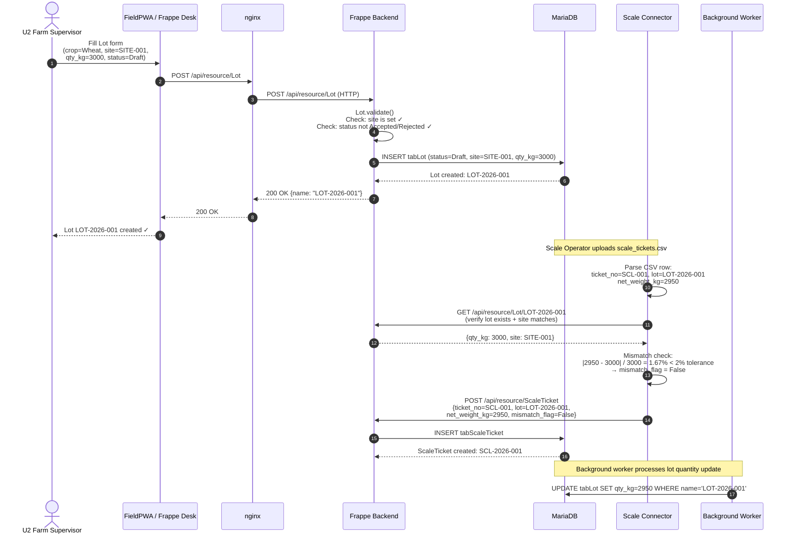
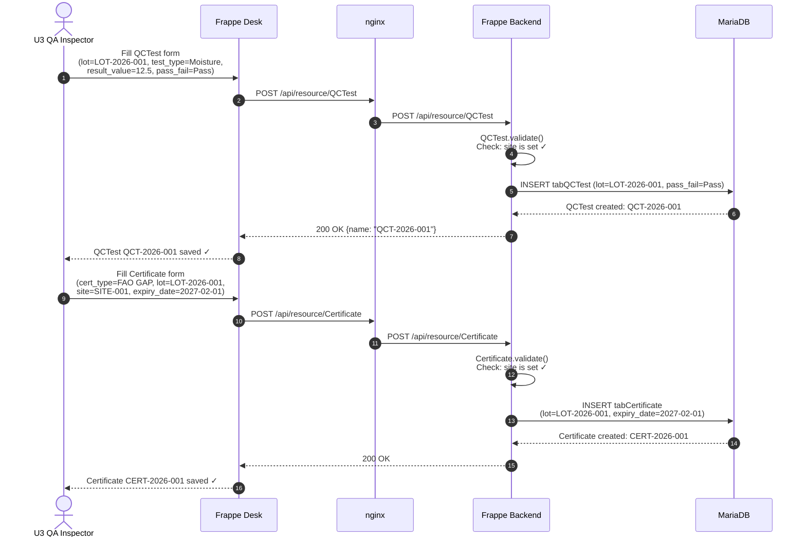
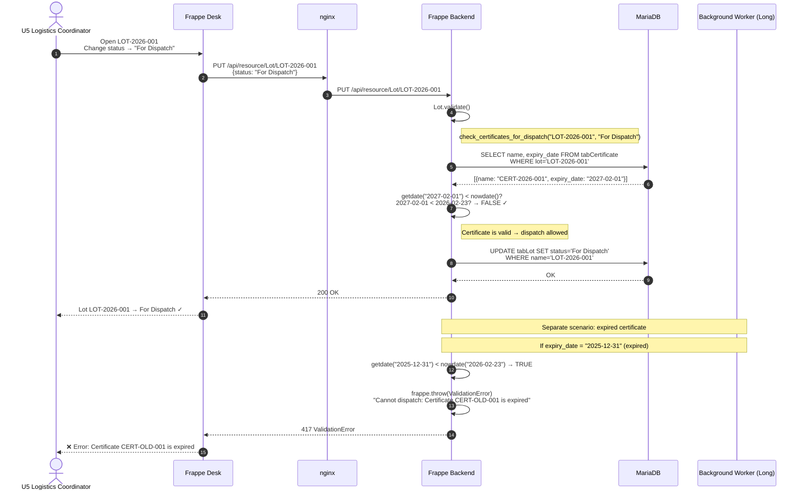
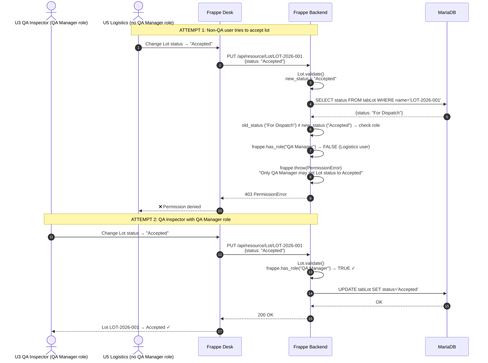

# C4 Dynamic Diagram — Lot Lifecycle

> **C4 Type:** Dynamic Diagram  
> **Scenario:** Lot creation through QC testing, certificate validation, and dispatch  
> **Version:** 1.1  
> **Date:** 2026-02-23  
> **Related:** [← Service Adapters](05_COMPONENT_SERVICE_ADAPTERS.md) | [Dynamic: AI Assist →](07_DYNAMIC_AI_ASSIST.md)

---

## Purpose

This dynamic diagram shows the **key runtime interactions** for the most critical business scenario in the YAM Agri Platform: a grain lot's lifecycle from receipt at a farm/silo through QC testing, certificate validation, and dispatch as a shipment. It illustrates the sequence of calls between containers and components for each stage.

---

## Scenario Overview

```
STAGE 1: Lot Receipt
  Farm Supervisor creates a Lot at the silo
  Scale Connector imports weight from CSV → ScaleTicket created
  Mismatch? → Nonconformance created automatically

STAGE 2: QC Testing
  QA Inspector records QC test results
  QA Inspector attaches compliance certificate

STAGE 3: Season Policy Check
  Logistics Coordinator attempts to set Lot status = "For Dispatch"
  System checks: all mandatory QC tests present? all certs valid?
  → PASS: Lot moves to "For Dispatch"
  → FAIL: Dispatch blocked; blocking reasons listed

STAGE 4: QA Manager Approval (for Accept/Reject)
  QA Manager reviews Lot; sets status = "Accepted" or "Rejected"
  System enforces: only QA Manager role may set these statuses
```

---

## Sequence Diagram — Stage 1: Lot Receipt + Scale Ticket



---

## Sequence Diagram — Stage 2: QC Test + Certificate



---

## Sequence Diagram — Stage 3: Season Policy Check at Dispatch



---

## Sequence Diagram — Stage 4: QA Manager Accept/Reject



---

## ASCII Summary — Lot Status Transitions

```
                    [Draft]
                       │
                       │ (Supervisor creates Lot)
                       │
               ┌───────▼────────┐
               │   scale_ticket │◀─── Scale Connector imports weight
               │   import       │     Nonconformance created if mismatch
               └───────┬────────┘
                       │
                       │ (QA Inspector records QCTest)
                       │ (QA Inspector attaches Certificate)
                       │
               ┌───────▼────────┐
               │  QC + Cert     │◀─── Frappe REST: POST QCTest, POST Certificate
               │  attached      │
               └───────┬────────┘
                       │
                       │ (Logistics: set status = "For Dispatch")
                       │ ← Server check: certificates not expired?
                       │
               ┌───────▼────────┐     ┌─────────────────────────────────────┐
               │  For Dispatch  │     │  BLOCKED if:                         │
               │                │     │  • Certificate expired               │
               │  (if certs OK) │     │  • [Future] Season policy not met    │
               └───────┬────────┘     └─────────────────────────────────────┘
                       │
                       │ (QA Manager approves)
                       │ ← Server check: frappe.has_role("QA Manager")
                       │
               ┌───────▼────────┐
               │   Accepted     │  ──── or ────  [Rejected]
               │                │               (QA Manager only)
               └───────┬────────┘
                       │
                       │ (dispatched)
                       ▼
                 [Dispatched]
```

---

## Key Business Rules Enforced (from code)

| Rule | Enforcement point | Code reference |
|------|------------------|---------------|
| Every Lot must have a Site | `Lot.validate()` | `lot.py:37` |
| Only QA Manager can Accept/Reject | `Lot.validate()` | `lot.py:46–58` |
| Dispatch blocked if cert expired | `check_certificates_for_dispatch()` | `lot.py:9–31` |
| Every Certificate must have a Site | `Certificate.validate()` | `certificate.py:9` |
| Every QCTest must have a Site | `QCTest.validate()` (inferred) | `qc_test.py` |
| Every Nonconformance must have a Site | `Nonconformance.validate()` | `nonconformance.py:8` |
| Site isolation on list queries | `permission_query_conditions` hook | `hooks.py:15–22` |

---

## Change Log

| Version | Date | Author | Change |
|---------|------|--------|--------|
| 1.0 | 2026-02-23 | YasserAKareem | Initial lot lifecycle dynamic diagram — V1.1 |
