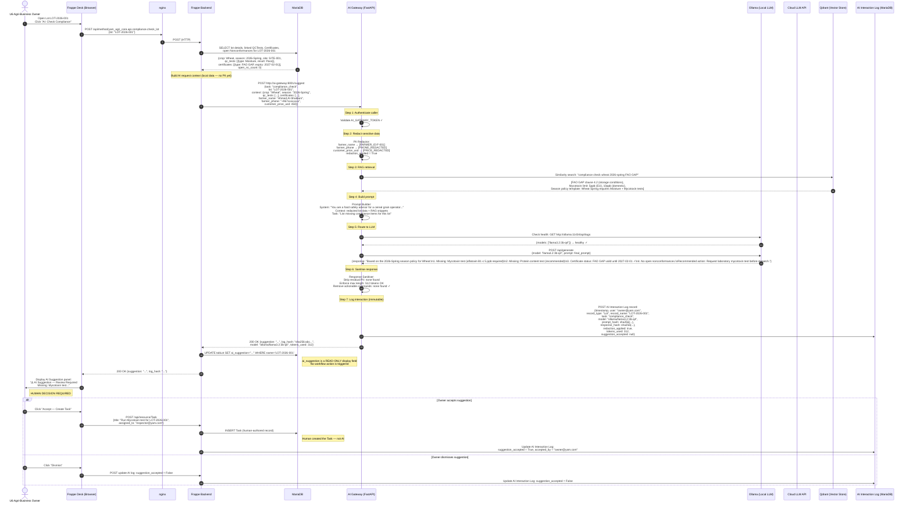
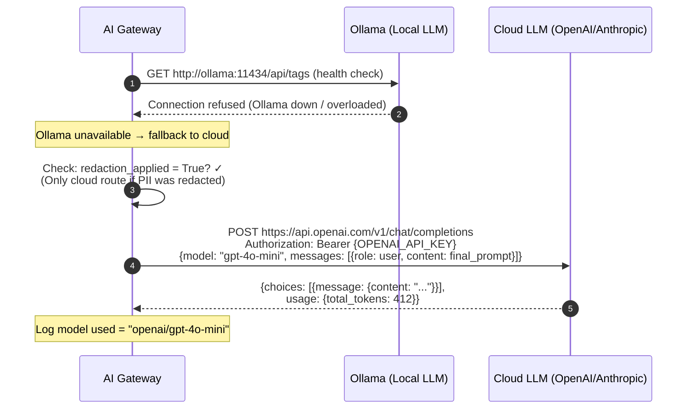

# C4 Dynamic Diagram — AI Assistance Flow

> **C4 Type:** Dynamic Diagram  
> **Scenario:** AI compliance check request from Frappe Desk through AI Gateway to LLM and back  
> **Version:** 1.1  
> **Date:** 2026-02-23  
> **Related:** [← Dynamic: Lot Lifecycle](06_DYNAMIC_LOT_LIFECYCLE.md) | [Deployment: Dev →](08_DEPLOYMENT_DEV.md)

---

## Purpose

This dynamic diagram shows how the **AI assistance flow** works in the YAM Agri Platform — from a user requesting an AI compliance check in the Frappe Desk UI, through the AI Gateway's redaction and routing pipeline, to the LLM inference and back to a read-only suggestion displayed to the user. It illustrates the **assistive-only guarantee** enforced at every step.

**Key invariant:** At no point in this flow does any container write to a DocType, change any workflow state, or take any action without an explicit human click.

---

## Diagram — AI Compliance Check Flow



---

## Diagram — Cloud LLM Fallback Path



---

## ASCII Summary — AI Assist Guarantee Chain

```
  User in Frappe Desk
    "Check compliance for LOT-001"
         │
         ▼
  Frappe Backend (READ-ONLY data gathering)
    • Queries local DB for lot, QC, certs, NCs
    • NO writes at this stage
         │
         ▼
  AI Gateway
    ┌─────────────────────────────────────┐
    │ 1. Authenticate (service token)     │
    │ 2. REDACT: PII, pricing, customer   │ ← blocks if redaction fails
    │ 3. RAG: retrieve relevant snippets  │
    │ 4. Build minimal prompt             │
    │ 5. Route: Ollama first → Cloud LLM  │ ← cloud only if redacted
    │ 6. Sanitise response                │
    │ 7. LOG: hash + record + user        │ ← immutable
    └─────────────────────────────────────┘
         │
         ▼
  Frappe Backend
    • Stores suggestion in READ-ONLY field
    • NO workflow action triggered
         │
         ▼
  Frappe Desk — AI Suggestion Panel
    "⚠️ AI Suggestion — Review Required"
    [Accept → Create Task] [Dismiss]
         │
         ▼
  HUMAN DECISION (mandatory)
    • Accept: HUMAN creates Task/record
    • Dismiss: AI interaction logged as dismissed
    
  ══════════════════════════════════════════
  AI NEVER:
  ✗ Sets Lot.status
  ✗ Approves/rejects Lot
  ✗ Creates Nonconformance automatically
  ✗ Sends customer communication
  ✗ Initiates recall
  ✗ Commits to production
  ══════════════════════════════════════════
```

---

## AI Interaction Audit Log Schema

Every AI interaction is recorded in the immutable AI Interaction Log:

| Field | Type | Description |
|-------|------|-------------|
| `name` | Auto | Document name (auto-generated) |
| `timestamp` | Datetime | UTC time of the AI call |
| `user` | Link → User | Who triggered the suggestion |
| `record_type` | Data | DocType of context record (e.g., "Lot") |
| `record_name` | Data | Record name (e.g., "LOT-2026-001") |
| `task` | Select | compliance_check / capa_draft / evidence_narrative |
| `model_used` | Data | e.g., "ollama/llama3.2:3b-q4" |
| `prompt_hash` | Data | SHA-256 of redacted prompt |
| `response_hash` | Data | SHA-256 of LLM response |
| `redaction_applied` | Check | Was PII redaction applied? |
| `tokens_used` | Int | Token count (for cost monitoring) |
| `suggestion_accepted` | Check | Did user accept or dismiss? (null until decided) |
| `accepted_by` | Link → User | User who accepted (if different from requester) |
| `accepted_at` | Datetime | When suggestion was accepted |

> ⚠️ **Proposed gap:** The `AI Interaction Log` DocType is not yet implemented as a Frappe DocType in `yam_agri_core`. See [11_PROPOSED_GAPS.md](11_PROPOSED_GAPS.md).

---

## Change Log

| Version | Date | Author | Change |
|---------|------|--------|--------|
| 1.0 | 2026-02-23 | YasserAKareem | Initial AI assist dynamic diagram — V1.1 |
