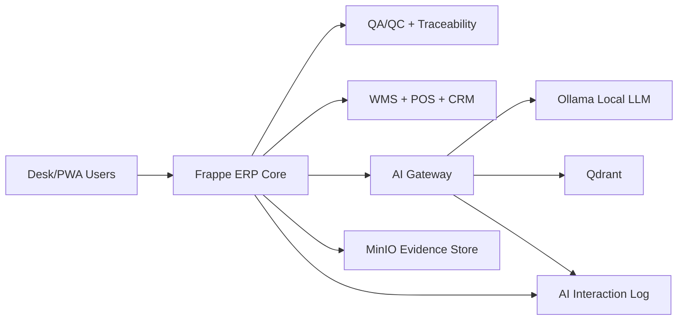

# YAM Agri Platform V1.1 — Work Breakdown Structure (WBS) & Gantt Chart

> **Document type:** Project Planning
> **Version:** 1.0
> **Date:** 2026-02-23
> **Owner:** YasserAKareem
> **Status:** ✅ Approved — baseline plan
> **Related:** [Project Charter](../Docs%20v1.1/01_PROJECT_CHARTER.md) | [Backlog & Features Inventory](BACKLOG_AND_FEATURES_INVENTORY.md)

---

## 1. WBS Overview

The WBS is decomposed into **10 delivery phases** (Phase 0–9) plus a cross-cutting **Documentation stream** and a **Post-V1.1 Backlog** for future releases.
Each WBS element is numbered hierarchically: `Phase.WorkPackage.Task`.

---

## 2. WBS Hierarchy

### Phase 0 — Dev Environment Setup

> Exit criterion: Docker Compose stack starts; Frappe login works; stack uses ≤ 6 GB RAM.

| WBS ID | Work Package / Task | Owner | Effort (d) | Depends on |
|--------|---------------------|-------|-----------|------------|
| **0** | **Dev Environment Setup** | DevOps | — | — |
| 0.1 | Docker Compose stack design | DevOps | 1 | — |
| 0.1.1 | Write `docker-compose.yml` (MariaDB, Redis, Frappe, nginx) | DevOps | 1 | — |
| 0.1.2 | Configure service healthchecks and `restart: always` | DevOps | 0.5 | 0.1.1 |
| 0.1.3 | Tune memory limits to ≤ 6 GB total | DevOps | 0.5 | 0.1.2 |
| 0.2 | `run.sh` helper script | DevOps | 1.5 | 0.1 |
| 0.2.1 | Commands: `up`, `down`, `logs`, `shell`, `init` | DevOps | 1 | 0.1 |
| 0.2.2 | Commands: `reset`, `backup`, `restore`, `prefetch`, `offline-init` | DevOps | 0.5 | 0.2.1 |
| 0.3 | Offline image archive (`offline-images.tar`) | DevOps | 0.5 | 0.1 |
| 0.4 | Frappe + ERPNext + Frappe Agriculture install | DevOps | 1 | 0.1 |
| 0.4.1 | `bench new-site` + ERPNext install | DevOps | 0.5 | 0.4 |
| 0.4.2 | Frappe Agriculture app install and verify | DevOps | 0.5 | 0.4.1 |
| 0.5 | VS Code dev container setup (devcontainer.json) | Dev | 0.5 | 0.4 |
| 0.6 | Phase 0 acceptance: stack start ≤ 5 min; login works | DevOps | 0.5 | 0.1–0.5 |

---

### Phase 1 — Custom App Scaffolding

> Exit criterion: `yam_agri_core` app installs on dev site; CI pipeline green.

| WBS ID | Work Package / Task | Owner | Effort (d) | Depends on |
|--------|---------------------|-------|-----------|------------|
| **1** | **Custom App Scaffolding** | Dev | — | Phase 0 |
| 1.1 | `bench new-app yam_agri_core` | Dev | 0.5 | 0 |
| 1.2 | Module structure (YAM Agri Core module) | Dev | 0.5 | 1.1 |
| 1.3 | App hooks (`hooks.py`) — fixtures, scheduler, signals | Dev | 1 | 1.2 |
| 1.4 | Workspace setup (Frappe Desk workspace) | Dev | 0.5 | 1.2 |
| 1.5 | CI / GitHub Actions pipeline | DevOps | 1 | 1.1 |
| 1.5.1 | Lint (flake8, eslint) | DevOps | 0.5 | 1.5 |
| 1.5.2 | Secret scan (truffleHog / git-secrets) | DevOps | 0.5 | 1.5 |
| 1.5.3 | Unit test runner (pytest) | DevOps | 0.5 | 1.5 |
| 1.6 | `requirements.txt` and `pyproject.toml` base | Dev | 0.5 | 1.1 |
| 1.7 | Phase 1 acceptance: app installs; CI green | DevOps | 0.5 | 1.1–1.6 |

---

### Phase 2 — Core DocTypes (12)

> Exit criterion: AT-01 (Create Site + StorageBin + Lot) and AT-10 (Site isolation) pass.

| WBS ID | Work Package / Task | Owner | Effort (d) | Depends on |
|--------|---------------------|-------|-----------|------------|
| **2** | **Core DocTypes** | Dev | — | Phase 1 |
| 2.1 | **Site DocType** | Dev | 1 | 1 |
| 2.1.1 | Fields: site_code, name, type, GPS, active | Dev | 0.5 | 2.1 |
| 2.1.2 | Permissions + User Permission link | Dev | 0.5 | 2.1.1 |
| 2.2 | **StorageBin DocType** | Dev | 1 | 2.1 |
| 2.2.1 | Fields: bin_code, site, capacity_kg, current_status | Dev | 0.5 | 2.2 |
| 2.2.2 | Site isolation permission query condition | Dev | 0.5 | 2.2.1 |
| 2.3 | **Device DocType** | Dev | 1 | 2.1 |
| 2.3.1 | Fields: device_id, site, type (scale/sensor/camera), active | Dev | 0.5 | 2.3 |
| 2.3.2 | Link to StorageBin | Dev | 0.5 | 2.3.1 |
| 2.4 | **Lot DocType** | Dev | 2 | 2.1 |
| 2.4.1 | Fields: lot_code, type, crop, variety, quantity_kg, site, bin, harvest_date | Dev | 1 | 2.4 |
| 2.4.2 | Lot status workflow (Draft→Received→In Storage→Released→Shipped/Rejected) | Dev | 0.5 | 2.4.1 |
| 2.4.3 | Server-side validation: site required; mass-balance guard stub | Dev | 0.5 | 2.4.2 |
| 2.5 | **Transfer DocType** | Dev | 1.5 | 2.4 |
| 2.5.1 | Fields: transfer_type, date, operator, source Lots child-table, dest Lots child-table | Dev | 1 | 2.5 |
| 2.5.2 | Approval flag for shipment transfers | Dev | 0.5 | 2.5.1 |
| 2.6 | **ScaleTicket DocType** | Dev | 1 | 2.4 |
| 2.6.1 | Fields: ticket_no, date, operator, gross/tare/net weight, lot, device | Dev | 0.5 | 2.6 |
| 2.6.2 | CSV import template definition | Dev | 0.5 | 2.6.1 |
| 2.7 | **QCTest DocType** | Dev | 1 | 2.4 |
| 2.7.1 | Fields: lot, test_type, test_date, lab, moisture_pct, protein_pct, mycotoxin_ppb, visual_score, pass_fail | Dev | 0.5 | 2.7 |
| 2.7.2 | Attachments + site link | Dev | 0.5 | 2.7.1 |
| 2.8 | **Certificate DocType** | Dev | 1 | 2.4 |
| 2.8.1 | Fields: cert_type, issuing_body, issue_date, expiry_date, lots_child_table, site, file_attachment | Dev | 0.5 | 2.8 |
| 2.8.2 | Expiry auto-flag (scheduled job) | Dev | 0.5 | 2.8.1 |
| 2.9 | **Nonconformance DocType** | Dev | 1 | 2.4 |
| 2.9.1 | Fields: nc_type, severity, description, root_cause, corrective_action, status, lot, site, cert | Dev | 0.5 | 2.9 |
| 2.9.2 | CAPA workflow (Open→Under Investigation→CA Assigned→Verification→Closed) | Dev | 0.5 | 2.9.1 |
| 2.10 | **EvidencePack DocType** | Dev | 1 | 2.4 |
| 2.10.1 | Fields: site, date_from, date_to, lot (optional), status, linked docs child-table | Dev | 0.5 | 2.10 |
| 2.10.2 | Scaffolded generate action (stub for Phase 7) | Dev | 0.5 | 2.10.1 |
| 2.11 | **Complaint DocType** | Dev | 0.5 | 2.4 |
| 2.11.1 | Fields: complaint_date, customer, lot, description, severity, status | Dev | 0.5 | 2.11 |
| 2.12 | **Observation DocType** | Dev | 1.5 | 2.3 |
| 2.12.1 | Fields: device, site, storage_bin, timestamp, metric_type, value, unit, quality_flag | Dev | 0.5 | 2.12 |
| 2.12.2 | quality_flag select options (Valid/Warning/Quarantine) | Dev | 0.5 | 2.12.1 |
| 2.12.3 | MQTT payload model doc (stub) | Dev | 0.5 | 2.12.2 |
| 2.13 | **RBAC + Site Isolation** | Dev | 2 | 2.1–2.12 |
| 2.13.1 | Role Profiles (YAM Farm Ops, YAM Warehouse, YAM QA Manager, etc.) | Dev | 0.5 | 2.13 |
| 2.13.2 | Permission query conditions on all DocTypes | Dev | 1 | 2.13.1 |
| 2.13.3 | New user default: no site access | Dev | 0.5 | 2.13.2 |
| 2.14 | Phase 2 acceptance: AT-01, AT-10 | Dev | 1 | 2.1–2.13 |

---

### Phase 3 — Traceability Engine

> Exit criterion: AT-03 (Split Lot), AT-04 (Backward trace), AT-05 (Forward trace) pass.

| WBS ID | Work Package / Task | Owner | Effort (d) | Depends on |
|--------|---------------------|-------|-----------|------------|
| **3** | **Traceability Engine** | Dev | — | Phase 2 |
| 3.1 | Transfer Split logic | Dev | 2 | 2 |
| 3.1.1 | Python controller: `on_submit` splits parent Lot quantity | Dev | 1 | 3.1 |
| 3.1.2 | Mass-balance enforcement (available_qty ≥ transfer_qty) | Dev | 0.5 | 3.1.1 |
| 3.1.3 | Unit tests for split controller | Dev | 0.5 | 3.1.2 |
| 3.2 | Transfer Merge logic | Dev | 1.5 | 3.1 |
| 3.2.1 | Controller: multiple parent Lots → single destination Lot | Dev | 1 | 3.2 |
| 3.2.2 | Unit tests for merge | Dev | 0.5 | 3.2.1 |
| 3.3 | Transfer Blend logic | Dev | 1 | 3.2 |
| 3.3.1 | Controller: multiple parents with mix ratios → destination Lot | Dev | 0.5 | 3.3 |
| 3.3.2 | Unit tests for blend | Dev | 0.5 | 3.3.1 |
| 3.4 | Backward Trace view | Dev | 2 | 3.1–3.3 |
| 3.4.1 | Recursive query: walk parent_lot links upstream | Dev | 1 | 3.4 |
| 3.4.2 | Frappe Script Report: Lot Backward Trace | Dev | 0.5 | 3.4.1 |
| 3.4.3 | Show QC/cert/bin history per ancestor lot | Dev | 0.5 | 3.4.2 |
| 3.5 | Forward Trace view | Dev | 1.5 | 3.1–3.3 |
| 3.5.1 | Recursive query: walk child_lot links downstream | Dev | 1 | 3.5 |
| 3.5.2 | Frappe Script Report: Lot Forward Trace | Dev | 0.5 | 3.5.1 |
| 3.6 | Phase 3 acceptance: AT-03, AT-04, AT-05 | Dev | 1 | 3.1–3.5 |

---

### Phase 4 — QA/QC Controls + Season Policy

> Exit criterion: AT-02 (QCTest + Certificate), AT-06 (Shipment gate) pass.

| WBS ID | Work Package / Task | Owner | Effort (d) | Depends on |
|--------|---------------------|-------|-----------|------------|
| **4** | **QA/QC Controls + Season Policy** | Dev + QA | — | Phase 3 |
| 4.1 | QCTest form validation | Dev | 1 | 3 |
| 4.1.1 | Pass/fail auto-calculation from thresholds | Dev | 0.5 | 4.1 |
| 4.1.2 | Mandatory test check per Season Policy | Dev | 0.5 | 4.1.1 |
| 4.2 | Certificate expiry enforcement | Dev | 1 | 3 |
| 4.2.1 | Scheduled job: flag expired certs daily | Dev | 0.5 | 4.2 |
| 4.2.2 | Lot submit validator: reject if cert expired | Dev | 0.5 | 4.2.1 |
| 4.3 | Season Policy DocType | Dev | 1.5 | 2 |
| 4.3.1 | Fields: crop, season, mandatory_tests (child table), mandatory_certs (child table), active | Dev | 0.5 | 4.3 |
| 4.3.2 | Sample fixtures (wheat/barley season policies) | Dev | 0.5 | 4.3.1 |
| 4.3.3 | Policy lookup from Lot submit controller | Dev | 0.5 | 4.3.2 |
| 4.4 | Shipment gating controller | Dev | 1.5 | 4.1–4.3 |
| 4.4.1 | Server-side: block Lot submit if policy not satisfied | Dev | 1 | 4.4 |
| 4.4.2 | Error message lists missing QC tests / expired certs | Dev | 0.5 | 4.4.1 |
| 4.5 | CAPA workflow (Nonconformance) | Dev | 1 | 2.9 |
| 4.5.1 | Workflow transitions + QA Manager approval gate on Critical NC | Dev | 0.5 | 4.5 |
| 4.5.2 | Auto-create NC on cert expiry or test failure | Dev | 0.5 | 4.5.1 |
| 4.6 | Certificate management UI (list view filter by expiry) | Dev | 0.5 | 4.2 |
| 4.7 | Phase 4 acceptance: AT-02, AT-06 | Dev + QA | 1 | 4.1–4.6 |

---

### Phase 5 — Scale + Sensor Integrations

> Exit criterion: AT-07 (ScaleTicket import + mismatch NC), AT-08 (Observation quarantine + alert) pass.

| WBS ID | Work Package / Task | Owner | Effort (d) | Depends on |
|--------|---------------------|-------|-----------|------------|
| **5** | **Scale + Sensor Integrations** | Dev | — | Phase 4 |
| 5.1 | ScaleTicket CSV import | Dev | 2 | 4 |
| 5.1.1 | CSV parser: validate columns, reject bad rows | Dev | 0.5 | 5.1 |
| 5.1.2 | Map ticket rows to existing Lots | Dev | 0.5 | 5.1.1 |
| 5.1.3 | Update Lot quantity from net weight | Dev | 0.5 | 5.1.2 |
| 5.1.4 | Row-level error report (import log) | Dev | 0.5 | 5.1.3 |
| 5.2 | Mismatch detection → auto-Nonconformance | Dev | 1 | 5.1 |
| 5.2.1 | Compare imported weight vs declared Lot quantity | Dev | 0.5 | 5.2 |
| 5.2.2 | If Δ > configurable tolerance → create NC (Weight Mismatch) | Dev | 0.5 | 5.2.1 |
| 5.3 | MQTT IoT Gateway | Dev | 2 | 2.12 |
| 5.3.1 | FastAPI/MQTT subscriber stub (`iot-gateway` service) | Dev | 1 | 5.3 |
| 5.3.2 | Translate MQTT payload → Frappe REST API (POST Observation) | Dev | 0.5 | 5.3.1 |
| 5.3.3 | Docker Compose service entry for iot-gateway | DevOps | 0.5 | 5.3.2 |
| 5.4 | Observation quality_flag validation | Dev | 1.5 | 2.12 |
| 5.4.1 | Configurable threshold table per metric_type + site | Dev | 0.5 | 5.4 |
| 5.4.2 | Server-side: set `quality_flag = Quarantine` if out-of-range | Dev | 0.5 | 5.4.1 |
| 5.4.3 | Quarantined data excluded from AI inputs without override | Dev | 0.5 | 5.4.2 |
| 5.5 | Critical threshold Frappe alerts | Dev | 1 | 5.4 |
| 5.5.1 | Notification when bin temp > 35 °C or humidity > 80% | Dev | 0.5 | 5.5 |
| 5.5.2 | Alert channels: Frappe desk + (optional) email | Dev | 0.5 | 5.5.1 |
| 5.6 | Phase 5 acceptance: AT-07, AT-08 | Dev | 1 | 5.1–5.5 |

---

### Phase 6 — AI Assist Layer (Propose-only)

> Exit criterion: AI suggestions visible in Frappe Desk; no auto-actions execute; AI governance log working.

| WBS ID | Work Package / Task | Owner | Effort (d) | Depends on |
|--------|---------------------|-------|-----------|------------|
| **6** | **AI Assist Layer** | Dev | — | Phase 5 |
| 6.1 | AI Gateway FastAPI service | Dev | 2 | 5 |
| 6.1.1 | POST `/suggest` endpoint (compliance check, CAPA draft, evidence summary) | Dev | 1 | 6.1 |
| 6.1.2 | PII/pricing/customer-ID redaction middleware | Dev | 0.5 | 6.1.1 |
| 6.1.3 | Docker Compose `ai-gateway` service | DevOps | 0.5 | 6.1.2 |
| 6.2 | AI Compliance Check tool (FR-AI-01) | Dev | 1.5 | 6.1 |
| 6.2.1 | Frappe button on Lot form → call AI Gateway | Dev | 0.5 | 6.2 |
| 6.2.2 | Display missing QC tests / expired certs / open NCs | Dev | 0.5 | 6.2.1 |
| 6.2.3 | UI shows "AI Suggestion — Review required" banner | Dev | 0.5 | 6.2.2 |
| 6.3 | CAPA Draft suggestion (FR-AI-02) | Dev | 1 | 6.1 |
| 6.3.1 | AI drafts corrective action plan for open Nonconformance | Dev | 0.5 | 6.3 |
| 6.3.2 | User must review and submit; auto-save is blocked | Dev | 0.5 | 6.3.1 |
| 6.4 | EvidencePack narrative summary (FR-AI-03) | Dev | 1 | 6.1 |
| 6.4.1 | AI drafts human-readable EvidencePack summary | Dev | 0.5 | 6.4 |
| 6.4.2 | User approves before narrative is included in PDF | Dev | 0.5 | 6.4.1 |
| 6.5 | AI interaction logging (FR-AI-05) | Dev | 1 | 6.1 |
| 6.5.1 | Log: timestamp, record ref, prompt hash, response hash, user, accepted/rejected | Dev | 0.5 | 6.5 |
| 6.5.2 | AI Log DocType (append-only) | Dev | 0.5 | 6.5.1 |
| 6.6 | AI governance tests | Dev + QA | 1 | 6.2–6.5 |
| 6.6.1 | Test: AI never triggers direct Lot accept/reject/recall | Dev | 0.5 | 6.6 |
| 6.6.2 | Test: PII redaction active for external LLM calls | Dev | 0.5 | 6.6.1 |
| 6.7 | Ollama local LLM integration (optional, Yemen offline) | Dev | 1 | 6.1 |

### Phase 6 Canonical Integrated Scope (single source of truth)

This section is the canonical scope definition for integrated ERP/MES/WMS/POS/CRM/AI modeling in this WBS.
All repeated scope text in other sections must reference this section instead of duplicating mappings.

#### Integrated Data Model and Module Mapping

#### 1) Platform scope (100 users, 10M USD, local-first)

- ERP Core: finance, procurement, inventory, sales/orders, CRM baseline, HR/payroll baseline.
- MES/Manufacturing: work orders, recipes/BOM, production batches, QA gates.
- WMS: multi-warehouse stock, transfers, picking/putaway, batch-location visibility.
- POS: 60 outlets, synced sales/returns with inventory, CRM, and finance.
- CRM: pipeline, campaign, service, contract touchpoints.
- Analytics + AI: unified reporting, alerts, predictive and advisory suggestions.

#### 2) Canonical module-to-entity mapping (Frappe/ERPNext + YAM custom)

| Module domain | Canonical entities / DocTypes |
|---------------|-------------------------------|
| Organization | Company, Cost Center, Branch/Location |
| Customer/Supplier | Customer, Supplier, Contact, Address |
| Product taxonomy (FAO 9 groups) | Item Group (Group 1..9), Item (40 SKUs), Item Attribute, Item Variant, custom field `fao_icc_code` |
| Location model | Site, Warehouse, StorageBin, Plant as Site Type, Retail outlet as Site Type |
| Contract farming (custom) | Contract Farming Agreement, Contract Plot Allocation, Contract Item Target, Contract Delivery Schedule, Contract Settlement |
| Batch/Lot traceability | Batch (ERPNext), Lot (YAM), ProductionBatch link, expiry/sell-by fields |
| Inventory/WMS | Stock Ledger Entry, Bin, Stock Entry, Transfer, Pick List, Delivery Note |
| Manufacturing/MES | BOM/Recipe, Work Order/Production Order, Job Card (optional), Quality Inspection, Recall (custom) |
| POS/Retail | POS Profile, POS Invoice, Sales Invoice, Sales Return, Complaint |
| Finance | Journal Entry, Payment Entry, GL Entry, Cost Center dimensions |
| Quality/Safety | QCTest, Certificate, Nonconformance, Quality Inspection, EvidencePack |
| AI/Analytics (custom + reporting) | AI Interaction Log (append-only custom), Model Registry (custom), reporting artifacts |

#### ERP↔MES↔WMS↔POS↔CRM↔AI interface contracts

| Interface | Source | Target | Contract payload (minimum) | Control |
|-----------|--------|--------|----------------------------|---------|
| ERP→MES Production release | ERP (Item/BOM/Work Order) | MES runtime | item, bom/recipe, qty, due_date, site | QA gate before release |
| MES→WMS Batch output | ProductionBatch/Work Order | Stock Entry/Bin/Batch | production_batch, lot/batch, qty, warehouse | lot/batch traceability required |
| WMS→POS Availability | Bin/Batch ledger | POS Profile/POS Invoice | item, available_qty, lot/batch, outlet_site | prevent oversell at outlet |
| POS→ERP Settlement | POS Invoice/Sales Return | GL/Payment/Customer ledger | invoice, return, taxes, payments, customer | financial posting validation |
| CRM↔ERP Service loop | Complaint/Service touchpoint | Sales/Quality records | complaint_ref, customer, lot, resolution_state | CAPA linkage required |
| AI↔Business records (assistive-only) | Lot/NC/EvidencePack context | AI Interaction Log + suggestion UI | source_record, prompt_hash, response_hash, decision | no autonomous write/transition |

#### Local open AI infrastructure profile (V1.2 enhancement)

- Runtime profile: Linux hosts with local-first services and offline resilience.
- AI stack: AI Gateway + Ollama (local model routing) + Qdrant (vector store) + MinIO (object evidence store).
- Infra context: OpenStack/Kubernetes profile is a deployment target after Docker Compose stability gates pass.
- Governance: assistive-only responses, redaction before external routing, append-only interaction logging.



Related architecture diagrams:
- `docs/C4 model Architecture v1.1/04_COMPONENT_AI_LAYER.md`
- `docs/C4 model Architecture v1.1/07_DYNAMIC_AI_ASSIST.md`
- `docs/C4 model Architecture v1.1/09_DEPLOYMENT_STAGING.md`

#### 3) ER relationship backbone (implementation target)

- Company `1..n` Site.
- Site `1..n` Warehouse/StorageBin.
- Item Group `1..n` Item.
- Item `1..n` Batch and Item `1..n` Lot.
- Contract Farming Agreement `1..n` Contract Plot Allocation.
- Contract Farming Agreement `1..n` Contract Item Target.
- Contract Harvest Event `n..1` Lot and `n..1` Contract Farming Agreement.
- Lot `1..n` QCTest, `1..n` Certificate, `1..n` Nonconformance, `1..n` Transfer, `1..n` ScaleTicket.
- Production Order `1..n` ProductionBatch and ProductionBatch `n..1` Lot/Batch.
- POS Invoice `n..1` Site and `n..n` Item via POS lines.
- Stock Movement `n..1` from Site/Warehouse and `n..1` to Site/Warehouse and `n..1` Batch/Lot.
- AI Interaction Log `n..1` Site and `n..1` source record (Lot/NC/EvidencePack), decision tracked per interaction.

#### 4) FAO 9 groups + 40 SKU governance

- Keep FAO hierarchy in Item Group with 9 top groups.
- Keep SKU catalog in Item with required attributes:
    - `sku_code`, `product_group`, `fao_icc_code`, `cpc_code`
    - `base_uom`, `pack_uom`, `shelf_life_days`
    - `quality_grade`, `organic_flag`, `gmo_flag`
    - `procurement_type`, `processing_stage`, `traceability_required`
- Enforce master-data validation before transactions (sales, procurement, production, POS).

#### FAO-to-SKU Governance and Contract Farming Canonical Model

#### 5) Contract farming canonical data model (practical)

- Agreement header: partner, season, dates, status, terms.
- Line targets: crop/SKU, area min/max, expected yield, quality grade, pricing basis.
- Allocation: farm/field/site assignment.
- Harvest event: actual yield, quality, lot link, date.
- Delivery event: destination, accepted quantity, rejection reason.
- Settlement: payment, bonuses/penalties, deductions, references.

#### 6) WBS expansion (de-duplicated)

- Add section: Integrated Data Model and Module Mapping.
- Add section: FAO-to-SKU Governance and Contract Farming Canonical Model.
- Add section: ERP↔MES↔WMS↔POS↔CRM↔AI interface contracts.
- Keep phase sequencing unchanged; this is scope-depth, not phase-order change.

#### 7) Acceptance criteria for this enhancement

- Single canonical mapping table only (no duplicate module/entity lists).
- Every entity mapped to actual Frappe/ERPNext DocType or explicit new custom DocType.
- FAO 9 groups and 40 SKUs traceable from master data to transaction flows.
- Contract farming flow traceable from agreement to settlement.
- Lot/Batch traceability preserved from farm/plant to POS and complaint/recall.
- AI logs linked to business records with decision outcomes (assistive-only governance).

---

### Phase 7 — EvidencePack Generator

> Exit criterion: AT-09 (EvidencePack for date range + site contains all docs) passes.

| WBS ID | Work Package / Task | Owner | Effort (d) | Depends on |
|--------|---------------------|-------|-----------|------------|
| **7** | **EvidencePack Generator** | Dev | — | Phase 6 |
| 7.1 | EvidencePack builder controller | Dev | 2 | 6 |
| 7.1.1 | Collect QC tests, certs, scale tickets, observations, NCs in scope | Dev | 1 | 7.1 |
| 7.1.2 | Link documents to EvidencePack child table | Dev | 0.5 | 7.1.1 |
| 7.1.3 | Status: Draft → Ready → Sent | Dev | 0.5 | 7.1.2 |
| 7.2 | PDF export | Dev | 1.5 | 7.1 |
| 7.2.1 | Jinja2 print format for EvidencePack | Dev | 1 | 7.2 |
| 7.2.2 | Include AI narrative (if approved) | Dev | 0.5 | 7.2.1 |
| 7.3 | ZIP export | Dev | 1 | 7.1 |
| 7.3.1 | Bundle all linked file attachments into ZIP | Dev | 0.5 | 7.3 |
| 7.3.2 | Downloadable from Frappe Desk | Dev | 0.5 | 7.3.1 |
| 7.4 | Auditor read-only portal view (stub for V1.2) | Dev | 0.5 | 7.1 |
| 7.5 | Phase 7 acceptance: AT-09 | Dev + QA | 1 | 7.1–7.4 |

---

### Phase 8 — Staging (k3s)

> Exit criterion: All 10 acceptance tests pass on k3s staging node.

| WBS ID | Work Package / Task | Owner | Effort (d) | Depends on |
|--------|---------------------|-------|-----------|------------|
| **8** | **Staging Environment** | DevOps | — | Phase 7 (all 10 AT pass on dev) |
| 8.1 | k3s single-node setup | DevOps | 1 | 7 |
| 8.1.1 | Provision server (VPS/bare-metal); k3s install | DevOps | 0.5 | 8.1 |
| 8.1.2 | Storage class + persistent volumes | DevOps | 0.5 | 8.1.1 |
| 8.2 | WireGuard VPN | DevOps | 1 | 8.1 |
| 8.2.1 | WireGuard server config; peer keys for team | DevOps | 0.5 | 8.2 |
| 8.2.2 | Restrict k3s API to VPN subnet | DevOps | 0.5 | 8.2.1 |
| 8.3 | Kubernetes manifests / Helm chart | DevOps | 2 | 8.1 |
| 8.3.1 | Helm chart: Frappe, MariaDB, Redis, nginx, iot-gateway, ai-gateway | DevOps | 1.5 | 8.3 |
| 8.3.2 | Secrets via k3s Secrets (never plaintext) | DevOps | 0.5 | 8.3.1 |
| 8.4 | Data migration: dev → staging | DevOps | 1 | 8.3 |
| 8.4.1 | `bench backup` on dev; restore on staging | DevOps | 0.5 | 8.4 |
| 8.4.2 | Fixture import for Season Policies, Role Profiles | DevOps | 0.5 | 8.4.1 |
| 8.5 | Run all 10 acceptance tests on staging | Dev + QA | 2 | 8.1–8.4 |
| 8.5.1 | AT-01 through AT-05 | Dev | 1 | 8.5 |
| 8.5.2 | AT-06 through AT-10 | Dev + QA | 1 | 8.5.1 |

---

### Phase 9 — V1.1 Release

> Exit criterion: Owner sign-off; release notes published; staging is the live system.

| WBS ID | Work Package / Task | Owner | Effort (d) | Depends on |
|--------|---------------------|-------|-----------|------------|
| **9** | **V1.1 Release** | Owner + DevOps | — | Phase 8 |
| 9.1 | Release notes (CHANGELOG / 12_RELEASE_NOTES.md) | Dev | 0.5 | 8 |
| 9.2 | Final documentation review | Dev + QA | 1 | 8 |
| 9.2.1 | Review all 12 Docs v1.1 documents | Dev | 0.5 | 9.2 |
| 9.2.2 | Update SRS change log | Dev | 0.5 | 9.2.1 |
| 9.3 | Owner sign-off meeting | Owner | 0.5 | 9.1–9.2 |
| 9.4 | GitHub release tag v1.1.0 | DevOps | 0.5 | 9.3 |
| 9.5 | Comms: team briefing + staging access grant | Owner | 0.5 | 9.4 |

---

### Stream D — Documentation (Parallel / Cross-cutting)

> Runs in parallel with all phases. Each doc must be updated before the relevant phase closes.

| WBS ID | Document | Owner | Phase gate |
|--------|----------|-------|-----------|
| D.1 | 01_PROJECT_CHARTER.md (enhanced with WBS) | Owner | Phase 0 |
| D.2 | 02_REQUIREMENTS_SPECIFICATION.md (SRS) | Dev + Owner | Phase 1 |
| D.3 | 03_SYSTEM_ARCHITECTURE.md | Dev | Phase 2 |
| D.4 | 04_DATA_MODEL.md | Dev | Phase 2 |
| D.5 | 05_API_SPECIFICATION.md | Dev | Phase 5 |
| D.6 | 06_SECURITY_AND_RBAC.md | DevOps | Phase 2 |
| D.7 | 07_TEST_PLAN.md | QA | Phase 4 |
| D.8 | 08_DEPLOYMENT_GUIDE.md | DevOps | Phase 8 |
| D.9 | 09_OPERATIONS_RUNBOOK.md | DevOps | Phase 8 |
| D.10 | 10_COMPLIANCE_AND_QUALITY.md | QA | Phase 4 |
| D.11 | 11_AI_GOVERNANCE.md | Dev + Owner | Phase 6 |
| D.12 | 12_RELEASE_NOTES.md | Dev | Phase 9 |
| D.13 | WBS_AND_GANTT.md (this document) | Owner | Phase 0 |
| D.14 | BACKLOG_AND_FEATURES_INVENTORY.md | Dev | Phase 0 |

---

### Stream B — Post-V1.1 Backlog (Future Releases)

| WBS ID | Release | Backlog Stage | Item Range | Focus |
|--------|---------|---------------|-----------|-------|
| B.1 | V1.2 | D, E, F | AGR-CEREAL-028–055 | Storage & Harvest AI |
| B.2 | V1.3 | A, B, C | AGR-CEREAL-001–027 | Pre-season Planning & Field Ops AI |
| B.3 | V2.0 | G, H | AGR-CEREAL-056–071 | Logistics, Trading & Processing AI |
| B.4 | V2.1+ | I | AGR-CEREAL-072–080 | Customer, Market & Platform AI |

---

## 3. WBS Summary (Effort Totals)

| Phase | Work Packages | Est. Effort (dev-days) | Calendar Weeks |
|-------|--------------|----------------------|----------------|
| 0 — Dev Environment | 6 | 7 | 1–2 |
| 1 — App Scaffolding | 7 | 5 | 2–3 |
| 2 — Core DocTypes (12) | 14 | 18 | 3–6 |
| 3 — Traceability Engine | 6 | 12 | 6–8 |
| 4 — QA/QC + Season Policy | 7 | 11 | 8–10 |
| 5 — Scale + Sensor | 6 | 10 | 10–12 |
| 6 — AI Assist | 7 | 12 | 12–14 |
| 7 — EvidencePack | 5 | 7 | 13–15 |
| 8 — Staging | 5 | 9 | 15–18 |
| 9 — V1.1 Release | 5 | 4 | 18–20 |
| D — Documentation | 14 | 10 | 1–20 (parallel) |
| **TOTAL V1.1** | **82** | **≈ 105** | **20 weeks** |

> Assumptions: 1 developer (part-time), 1 DevOps, 1 QA (part-time). Effort days = 1 person working a full 8-hour day.

---

## 4. Gantt Chart

> Timeline: 20 calendar weeks starting Week 1 (2026-02-23).
> Legend: `█` = active  |  `▒` = buffer / review  |  `░` = parallel doc stream

```
Phase / Work Package                    W1  W2  W3  W4  W5  W6  W7  W8  W9  W10 W11 W12 W13 W14 W15 W16 W17 W18 W19 W20
─────────────────────────────────────── ─── ─── ─── ─── ─── ─── ─── ─── ─── ─── ─── ─── ─── ─── ─── ─── ─── ─── ─── ───
Ph0  Docker Compose + run.sh            ███ ███
Ph0  Frappe+ERPNext install                 ███
Ph0  Acceptance (AT-env)                    ▒▒▒
─────────────────────────────────────── ─── ─── ─── ─── ─── ─── ─── ─── ─── ─── ─── ─── ─── ─── ─── ─── ─── ─── ─── ───
Ph1  bench new-app + hooks                      ███
Ph1  CI/CD pipeline                             ███
Ph1  Acceptance (app installs)                  ▒▒▒
─────────────────────────────────────── ─── ─── ─── ─── ─── ─── ─── ─── ─── ─── ─── ─── ─── ─── ─── ─── ─── ─── ─── ───
Ph2  Site + StorageBin + Device                     ███ ███
Ph2  Lot + Transfer + ScaleTicket                   ███ ███ ███
Ph2  QCTest + Certificate + NC                          ███ ███
Ph2  EvidencePack + Complaint + Obs                         ███ ███
Ph2  RBAC + Site Isolation                                  ███ ███
Ph2  Acceptance AT-01, AT-10                                    ▒▒▒
─────────────────────────────────────── ─── ─── ─── ─── ─── ─── ─── ─── ─── ─── ─── ─── ─── ─── ─── ─── ─── ─── ─── ───
Ph3  Split / Merge / Blend controllers                              ███ ███
Ph3  Backward + Forward trace views                                     ███ ███
Ph3  Acceptance AT-03/04/05                                                 ▒▒▒
─────────────────────────────────────── ─── ─── ─── ─── ─── ─── ─── ─── ─── ─── ─── ─── ─── ─── ─── ─── ─── ─── ─── ───
Ph4  QCTest validation + Season Policy                                          ███ ███
Ph4  Shipment gate + CAPA workflow                                                  ███ ███
Ph4  Acceptance AT-02, AT-06                                                            ▒▒▒
─────────────────────────────────────── ─── ─── ─── ─── ─── ─── ─── ─── ─── ─── ─── ─── ─── ─── ─── ─── ─── ─── ─── ───
Ph5  ScaleTicket CSV import                                                                 ███ ███
Ph5  MQTT IoT gateway                                                                       ███ ███
Ph5  Observation quality_flag + alerts                                                          ███ ███
Ph5  Acceptance AT-07, AT-08                                                                        ▒▒▒
─────────────────────────────────────── ─── ─── ─── ─── ─── ─── ─── ─── ─── ─── ─── ─── ─── ─── ─── ─── ─── ─── ─── ───
Ph6  AI Gateway FastAPI service                                                                         ███ ███
Ph6  Compliance check + CAPA draft                                                                          ███ ███
Ph6  AI logging + governance tests                                                                          ███ ███
─────────────────────────────────────── ─── ─── ─── ─── ─── ─── ─── ─── ─── ─── ─── ─── ─── ─── ─── ─── ─── ─── ─── ───
Ph7  EvidencePack builder                                                                                   ███ ███
Ph7  PDF + ZIP export                                                                                           ███
Ph7  Acceptance AT-09                                                                                           ▒▒▒
─────────────────────────────────────── ─── ─── ─── ─── ─── ─── ─── ─── ─── ─── ─── ─── ─── ─── ─── ─── ─── ─── ─── ───
Ph8  k3s + WireGuard setup                                                                                          ███ ███ ███
Ph8  Helm chart + data migration                                                                                    ███ ███ ███
Ph8  All 10 AT on staging                                                                                               ▒▒▒ ▒▒▒
─────────────────────────────────────── ─── ─── ─── ─── ─── ─── ─── ─── ─── ─── ─── ─── ─── ─── ─── ─── ─── ─── ─── ───
Ph9  Release notes + sign-off                                                                                                   ███ ███
Ph9  GitHub tag v1.1.0                                                                                                              ███
─────────────────────────────────────── ─── ─── ─── ─── ─── ─── ─── ─── ─── ─── ─── ─── ─── ─── ─── ─── ─── ─── ─── ───
Doc  Documentation stream (parallel)    ░░░ ░░░ ░░░ ░░░ ░░░ ░░░ ░░░ ░░░ ░░░ ░░░ ░░░ ░░░ ░░░ ░░░ ░░░ ░░░ ░░░ ░░░ ░░░ ░░░
─────────────────────────────────────── ─── ─── ─── ─── ─── ─── ─── ─── ─── ─── ─── ─── ─── ─── ─── ─── ─── ─── ─── ───
MILESTONE                               M0                  M2              M3      M4      M5      M6-7    M8          M9
```

### Milestones

| Milestone | Date (approx.) | Description |
|-----------|---------------|-------------|
| M0 | Week 2 (2026-03-06) | Dev environment live; Frappe login works |
| M1 | Week 3 (2026-03-13) | `yam_agri_core` app scaffold installed; CI green |
| M2 | Week 6 (2026-04-03) | All 12 core DocTypes live; AT-01, AT-10 pass |
| M3 | Week 8 (2026-04-17) | Traceability engine complete; AT-03/04/05 pass |
| M4 | Week 10 (2026-05-01) | QA/QC + Season Policy gate; AT-02/06 pass |
| M5 | Week 12 (2026-05-15) | Scale + Sensor integrations; AT-07/08 pass |
| M6 | Week 14 (2026-05-29) | AI Assist layer running (propose-only) |
| M7 | Week 15 (2026-06-05) | EvidencePack generator; AT-09 passes |
| M8 | Week 18 (2026-06-26) | All 10 AT pass on k3s staging |
| M9 | Week 20 (2026-07-10) | **V1.1 Release** — owner sign-off; tag v1.1.0 |

---

## 5. Critical Path

```
Ph0 → Ph1 → Ph2 (DocTypes + RBAC) → Ph3 (Traceability)
                                   → Ph4 (QA/QC)
                                             → Ph5 (Scale/Sensor)
                                                       → Ph6 (AI)
                                                           → Ph7 (EvidencePack)
                                                                     → Ph8 (Staging)
                                                                               → Ph9 (Release)
```

The **critical path** runs through all 10 phases in sequence. Phase 6 and Phase 7 share a partial overlap (Ph7 starts in parallel with late Ph6 tasks).

---

## 6. Dependency Matrix (Key Dependencies)

| Task | Depends on | Risk if delayed |
|------|-----------|----------------|
| Ph1 app scaffold | Ph0 complete | Blocks all development |
| Ph2 Lot DocType | Ph1 + Site DocType | Blocks Traceability and QA/QC |
| Ph3 Traceability | Ph2 all 12 DocTypes | AT-03/04/05 cannot pass |
| Ph4 Shipment gate | Ph3 + Season Policy DocType | AT-06 cannot pass |
| Ph5 CSV import | Ph4 (ScaleTicket + NC exist) | AT-07 cannot pass |
| Ph5 IoT Gateway | Ph2 Observation DocType | AT-08 cannot pass |
| Ph6 AI Gateway | Ph5 complete | AI suggestions not available |
| Ph7 EvidencePack | Ph6 (narrative stub ready) | AT-09 cannot pass |
| Ph8 Staging | All 10 AT pass on dev | V1.1 release blocked |
| Ph9 Release | Ph8 all AT pass | Cannot go live |

---

## 7. Resource Plan

| Role | V1.1 Commitment | Primary phases |
|------|----------------|---------------|
| Developer | 80% (part-time) | Ph1–Ph7 |
| DevOps (Ibrahim Al-Sana'ani) | 50% | Ph0, Ph1.5, Ph8 |
| QA Inspector | 30% | Ph4, Ph5, Ph7, Ph8 |
| Product Owner (Yasser) | 20% | Reviews, sign-offs, Phase 9 |

---

## 8. Risk Register (Planning View)

| Risk | Phase exposed | Mitigation task |
|------|--------------|----------------|
| Power outage during dev | All | `restart: always`; InnoDB recovery tested in Ph0 |
| Internet unavailable for Docker pull | Ph0 | Offline image tar (WBS 0.3) |
| Site isolation breach | Ph2 | AT-10 mandatory before Ph3 starts |
| AI suggestion executed autonomously | Ph6 | Server-side guard (WBS 6.6.1) |
| Secret committed to Git | Ph1+ | CI secret scan (WBS 1.5.2) |
| k3s setup delays V1.1 | Ph8 | Ph8 is gated on dev passing all ATs |

---

## 9. Change Control

Any change to scope, timeline, or budget must be:
1. Raised as a GitHub Issue with label `change-request`
2. Reviewed by the Product Owner
3. Reflected in this document (version incremented) before work begins

---

## 10. Document History

| Version | Date | Author | Change |
|---------|------|--------|--------|
| 1.0 | 2026-02-23 | YasserAKareem | Initial WBS + Gantt for V1.1 |

---

## 11. Execution Status Snapshot (2026-02-25)

This snapshot reflects the current workbook-tracked execution status after WBS refresh automation (`refresh_wbs_milestones.py`, `prefill_wbs_categories.py`, `refresh_wbs_rows.py`).

### 11.1 Milestone Status

| Milestone | Status |
|-----------|--------|
| M0 | ✅ Done |
| M1 | ✅ Done |
| M2 | ✅ Done |
| M3 | ✅ Done |
| M4 | ✅ Done |
| M5 | ✅ Done |
| M6 | ⬜ Pending |
| M7 | ⬜ Pending |
| M8 | ⬜ Pending |
| M9 | ⬜ Pending |

### 11.2 Phase Status (Row-level WBS)

| Phase | Done | Partial | Not Started | Total | Status |
|------|-----:|--------:|------------:|------:|--------|
| Phase 0 | 14 | 0 | 0 | 14 | ✅ Done |
| Phase 1 | 11 | 0 | 0 | 11 | ✅ Done |
| Phase 2 | 23 | 0 | 0 | 23 | ✅ Done |
| Phase 3 | 13 | 0 | 0 | 13 | ✅ Done |
| **Phase 4** | **17** | **0** | **0** | **17** | **✅ Done** |
| **Phase 5** | **17** | **0** | **0** | **17** | **✅ Done** |
| Phase 6 | 0 | 0 | 13 | 13 | ⬜ Pending |
| Phase 7 | 0 | 0 | 9 | 9 | ⬜ Pending |
| Phase 8 | 0 | 0 | 10 | 10 | ⬜ Pending |
| Phase 9 | 0 | 0 | 8 | 8 | ⬜ Pending |

### 11.3 Phase 4 Closure Evidence (WBS + Sample Data + Low-code Work)

| Stream | Status | Evidence |
|--------|--------|----------|
| WBS execution status | ✅ Done | M4 marked done and all Phase 4 rows are done after category prefill + row refresh |
| Acceptance gates | ✅ Done | AT-02 and AT-06 pass in repeatable run window (`run_at02_automated_check`, `run_at06_automated_check`) |
| Cross-site regression guard | ✅ Done | AT-10 remains pass in same cycle (`run_at10_automated_check`) |
| Sample data baseline | ✅ Done | Static Yemen dataset generated with 250 scenarios and bench-imported successfully |
| Bench import + strict gate | ✅ Done | `seed_phase4_yemen_dataset` + `verify_phase4_yemen_dataset` + strict gate returned `pass` with `mismatch_count=0` |
| Low-code execution path | ✅ Done | Bench wrapper commands validated end-to-end with real outputs on `localhost` |

### 11.4 Phase 4 Sample-data Coverage (Yemen Context)

Phase 4 evidence must include two-site data and disruption-aware records aligned to Yemen constraints:

- Sites: minimum 2 (`Site A`, `Site B`) for isolation + dispatch gate checks.
- Lots: at least one dispatch-candidate lot per site with policy-bound crop/season.
- QC scenarios: missing test, stale test, fresh valid test.
- Certificate scenarios: missing cert, expired cert, valid cert.
- Dispatch outcomes:
    - blocked when mandatory QC/cert missing,
    - blocked when QC stale or cert expired,
    - allowed after evidence refresh.
- Reliability context records:
    - intermittent/outage windows represented in timestamps,
    - offline-safe rerun capability (same commands, deterministic output).

Recommended replay size for Yemen-context full-scenario validation (now validated):

- **250 records** total across **5 governorates** and **5 sites**.
- Expected generated operational counts after import:
    - Lots: `250`
    - QCTest: `184` (records with `qc_state != Missing`)
    - Certificates: `165` (records with `certificate_state != Missing`)
    - Transfers: `208` (records with `transfer_type != None`)
    - Scale Tickets: `250`
    - Observations: `250`
- Yemen-specific scenario axes included:
    - connectivity: `2G`, `3G`, `Intermittent`, `Offline Queue`
    - power: `Stable`, `Outage-2h`, `Outage-6h`
    - dispatch outcomes: `Allowed` + `Blocked`

### 11.5 Low-code Steps (Operator Runbook)

Run from the repository root via docker wrapper:

1. `bash infra/docker/run.sh preflight`
2. `Copy-Item artifacts/evidence/phase4_at02_at06/phase4_yemen_sample_data_250.json apps/yam_agri_core/yam_agri_core/yam_agri_core/seed/phase4_yemen_sample_data_250.json -Force`
3. `bash infra/docker/run.sh bench --site localhost execute yam_agri_core.yam_agri_core.seed.dev_data.seed_phase4_yemen_dataset --kwargs '{"confirm":1,"limit":250,"dataset_file":"apps/yam_agri_core/yam_agri_core/yam_agri_core/seed/phase4_yemen_sample_data_250.json"}'`
4. `bash infra/docker/run.sh bench --site localhost execute yam_agri_core.yam_agri_core.seed.dev_data.verify_phase4_yemen_dataset --kwargs '{"limit":250,"dataset_file":"apps/yam_agri_core/yam_agri_core/yam_agri_core/seed/phase4_yemen_sample_data_250.json"}'`
5. `bash infra/docker/run.sh bench --site localhost execute yam_agri_core.yam_agri_core.seed.dev_data.verify_phase4_yemen_dataset_gate --kwargs '{"limit":250,"strict":1,"dataset_file":"apps/yam_agri_core/yam_agri_core/yam_agri_core/seed/phase4_yemen_sample_data_250.json"}'`
6. `bash infra/docker/run.sh bench --site localhost execute yam_agri_core.yam_agri_core.health.checks.run_at02_automated_check`
7. `bash infra/docker/run.sh bench --site localhost execute yam_agri_core.yam_agri_core.health.checks.run_at06_automated_check`
8. `bash infra/docker/run.sh bench --site localhost execute yam_agri_core.yam_agri_core.health.checks.run_at10_automated_check`
9. `python tools/evidence_capture/run_evidence_collector.py --scenario tools/evidence_capture/scenario.phase4_at02_at06.json`
10. `python tools/refresh_wbs_milestones.py`
11. `python tools/prefill_wbs_categories.py`
12. `python tools/refresh_wbs_rows.py`

### 11.6 Detailed Next WBS Steps (Phase 5 kickoff)

#### 5.1 ScaleTicket CSV Import (WBS 5.1.1–5.1.4)

- 5.1.1 Build parser with hard column validation and row-level error log export.
- 5.1.2 Enforce site-safe lot resolution (`lot.site == ticket.site`).
- 5.1.3 Post net-weight updates with non-negative guards and traceable mutation log.
- 5.1.4 Produce import evidence artifact (`import_log.json/csv`) for AT-07.

#### 5.2 Auto-Nonconformance from mismatch (WBS 5.2.1–5.2.2)

- 5.2.1 Add configurable tolerance per site (initial default: `2.5%`).
- 5.2.2 Auto-create `Nonconformance` when absolute delta exceeds tolerance.
- QA flow: `Open -> Under Review -> Closed` with `QA Manager` gate on close.

#### 5.3 IoT/MQTT ingest (WBS 5.3.1–5.3.3)

- 5.3.1 Stand up lightweight gateway (FastAPI + MQTT subscriber) in compose.
- 5.3.2 Transform MQTT payloads to `Observation` API schema and preserve raw payload.
- 5.3.3 Add restart-safe container config and health check for outage recovery.

#### 5.4 Observation quarantine controls (WBS 5.4.1–5.4.3)

- 5.4.1 Define per-site thresholds for temperature/humidity and sensor quality flags.
- 5.4.2 Auto-set `quality_flag=Quarantine` for out-of-range observations.
- 5.4.3 Default AI/executive views to exclude quarantined observations.

#### 5.5 Alerts + AT-07/AT-08 closure (WBS 5.5.1–5.6)

- 5.5.1 Configure desk alerts for `temp > 35C` or `humidity > 80%`.
- 5.5.2 Validate alert channels in low-bandwidth mode (Desk first, optional email).
- 5.6 Run AT-07 and AT-08 in one evidence window, then refresh WBS status scripts.

#### Phase 5 sample-data size (Yemen full-scenario recommendation)

- Sites: `5` (same governorate spread used in Phase 4 dataset).
- ScaleTicket rows: `300` minimum (60/site) with at least:
    - `70` clean rows,
    - `70` row-level CSV errors,
    - `80` tolerance-pass mismatches,
    - `80` tolerance-fail mismatches (must auto-create NC).
- Observation rows: `480` minimum (96/site) covering:
    - connectivity states (`2G`, `3G`, `Intermittent`, `Offline Queue`),
    - power states (`Stable`, `Outage-2h`, `Outage-6h`),
    - threshold bands (`normal`, `warning`, `quarantine`).

#### Phase 5 low-code execution steps (operator)

1. Confirm stack health: `bash infra/docker/run.sh preflight`.
2. Import Phase 4 baseline 250 dataset and run strict gate (commands in 11.5).
3. Prepare AT-07 CSV batch files: `clean.csv`, `errors.csv`, `mismatch_pass.csv`, `mismatch_fail.csv`.
4. Run AT-07 import command(s) and save import logs as evidence artifacts.
5. Start MQTT test publisher with outage/intermittent replay set.
6. Run AT-08 observation checks; confirm quarantine flags and alerts.
7. Execute smoke bundle and evidence collector.
8. Refresh WBS milestone/row status scripts and attach outputs to run log.

### 11.7 Phase 5 Implementation Update (2026-02-25)

- Scope delivered in this cycle: WBS 5.1 to 5.5 runtime foundations and automated acceptance checks.
- Data and import runtime:
    - Added Phase 5 Yemen contract seed, verify, and strict gate in dev seed utilities.
    - Added AT-07 CSV importer API with schema validation, site-safe lot resolution, mismatch tolerance, lot mutation log, and evidence artifact output.
    - Added Site Tolerance Policy DocType and server-side policy validation.
- Compliance runtime:
    - Added auto-Nonconformance creation path for mismatch-fail rows.
    - Enforced server-side QA Manager gate for Nonconformance status transition to Closed.
- IoT and monitoring runtime:
    - Added Dockerized MQTT broker and FastAPI IoT gateway service with health checks and restart-safe compose wiring.
    - Added Observation Threshold Policy DocType and runtime quarantine/alert tagging flow in Observation validation.
    - Added executive observation API behavior that excludes Quarantine rows by default.
- Acceptance status:
    - AT-07 automated check: pass.
    - AT-08 automated check: pass.
    - Frappe Skill Agent quality scan: pass (0 findings).

### 11.8 Phase 5 Closure Status (WBS + Sample Data + Low-code)

| Stream | Status | Evidence |
|--------|--------|----------|
| WBS 5.1 (CSV Import) | ✅ Done | Runtime API `import_scale_tickets_csv` with schema validation, site-safe lot resolution, and import artifact output |
| WBS 5.2 (Tolerance + NC) | ✅ Done | `Site Tolerance Policy` active policy lookup + mismatch-fail auto-NC + QA-only NC close gate |
| WBS 5.3 (IoT Ingest) | ✅ Done | Dockerized `mqtt` + `iot-gateway` services with restart and health checks in compose |
| WBS 5.4 (Quarantine) | ✅ Done | `Observation Threshold Policy` with runtime threshold evaluation and automatic `quality_flag=Quarantine` |
| WBS 5.5/5.6 (Alerts + Acceptance) | ✅ Done | Multi-channel alert metadata tagging + AT-07 and AT-08 smoke checks passing |
| Sample-data contract | ✅ Done | Phase 5 Yemen dataset: 5 sites, 300 ScaleTicket rows, 480 Observation rows, strict gate pass |
| Low-code run path | ✅ Done | Gateway up + bench checks + evidence artifacts executed in one cycle |

### 11.9 Detailed Next WBS Steps (Phase 6 kickoff)

This kickoff section is intentionally de-duplicated.

- Canonical functional scope, module/entity mapping, ER backbone, FAO/SKU governance, and contract model:
    see **Phase 6 Canonical Integrated Scope (single source of truth)** in this document.
- Execution focus for next cycle:
        1. Implement AI Gateway (`POST /suggest`) with redaction middleware.
        2. Deliver Compliance/CAPA/Evidence suggestion UX as assistive-only flows.
        3. Add append-only AI Interaction Log + decision outcomes.
        4. Run governance tests: no autonomous writes and redaction enforcement.
        5. Prepare Phase 6 sample-data and low-code runbook evidence.

### 11.10 Phase 7 Closure Status (2026-02-27)

- Phase 7 implementation is completed and committed.
- EvidencePack generator scope delivered: linked record builder, PDF export, ZIP export, auditor portal stub, AT-09 automation.
- Execution evidence document: `docs/PHASE7_EXECUTION_LOG_2026-02-27.md`.
- Acceptance status:
    - `run_at09_automated_check`: pass
    - `run_phase7_smoke`: pass
    - `bench --site localhost run-tests --app yam_agri_core`: pass

### 11.11 Phase 8 Kickoff Status (2026-02-27)

- Phase 8 planning/execution kickoff started with staging baseline assets:
    - `environments/staging/config.yaml`
    - `environments/staging/.env.example`
    - `environments/staging/manifests/*` (modular k3s manifests)
    - `environments/staging/scripts/preflight.sh`
    - `environments/staging/scripts/generate-secrets.sh`
    - `environments/staging/scripts/phase8_acceptance.sh`
- Kickoff execution plan document: `docs/PHASE8_KICKOFF_PLAN_2026-02-27.md`.
- Next closure target remains M8: all AT-01 through AT-10 pass on staging.
